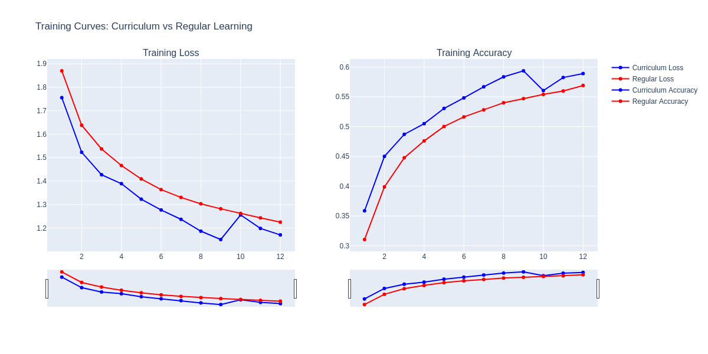

# Curriculum Training for Neural Networks

## Overview
This repository demonstrates the effectiveness of curriculum learning in neural network training through a series of toy examples. Curriculum learning is an approach where models are trained on progressively more difficult examples, similar to how humans learn - starting with basic concepts before tackling complex ones.

## Key Findings
- Improved Performance: Curriculum training achieved 59.47% test accuracy vs 55.11% for standard training on CIFAR-10
- Faster Convergence: Models trained with curriculum learning reach higher accuracy levels earlier in training
- Better Generalization: The curriculum-trained model shows better performance on the test set, suggesting improved generalization
- Same Architecture: These improvements come without changing the model architecture - only the training regime differs

## Concept
### Curriculum learning involves training neural networks in a staged approach:

- Start with simplified versions of the problem (lower resolution images)
- Gradually increase difficulty (higher resolutions)
- Allow the network to build foundational representations before tackling full complexity
This approach mirrors human learning, where we typically master basics before advancing to complex concepts.

### Experiment Design
This repository contains experiments comparing:

* Curriculum Training: Training on progressively higher resolution images (16×16 → 24×24 → 32×32 → 48×48)
* Standard Training: Training directly on the final resolution (48×48)
Both approaches use identical:

- Model architecture (simple CNN)
- Total training epochs
- Optimization parameters
- Dataset (CIFAR-10)

### Usage:
```
# With custom parameters
python curriculum_training_toy.py \
  --batch-size 64 \
  --learning-rate 0.001 \
  --epochs-per-stage 3 \
  --resolutions 16 24 32 48 \
  --final-resolution 48 \
  --accuracy-threshold 0.6 \
  --seed 123
```
#### Key Parameters
- --resolutions: Sequence of image resolutions for curriculum stages
- --epochs-per-stage: Number of epochs to train at each resolution
- --final-resolution: Resolution for evaluation and standard training
- --checkpoint-interval: Epochs between saving model checkpoints


# Curriculum Learning Experiments

This repository contains experiments and analysis on curriculum learning for neural network training.

## Results

The experiments consistently show that curriculum learning outperforms standard training:

| Metric | Curriculum Learning | Standard Training |
|--------|---------------------|-------------------|
| Test Accuracy | 59.47% | 55.11% |
| AUC (normalized) | 0.4901 | 0.4589 |
| Late-Stage AUC | 0.4830 | 0.4582 |

### Visualization

Training curves showing the performance difference between curriculum and standard training:

[Insert visualization here]

## Educational Value

This repository serves as an educational resource for:

- Understanding curriculum learning concepts
- Implementing progressive training strategies
- Analyzing training dynamics through metrics and visualizations
- Exploring how training regimes affect model performance

## Getting Started

```bash
# Clone the repository
git clone https://github.com/yourusername/curriculum-training-examples.git
cd curriculum-training-examples

# Install dependencies
pip install -r requirements.txt

python curriculum_training_toy.py \
  --batch-size 64 \
  --learning-rate 0.001 \
  --epochs-per-stage 3 \
  --resolutions 16 24 32 48 \
  --final-resolution 48 \
  --accuracy-threshold 0.6 \
  --seed 123
```

## Curriculum Learning Analysis

### Understanding the Results

#### Performance Comparison

The experiment results demonstrate a clear advantage for curriculum learning over standard training:

| Metric | Curriculum Learning | Standard Training | Improvement |
|--------|---------------------|-------------------|-------------|
| Test Accuracy | 59.47% | 55.11% | +4.36% |
| AUC (normalized) | 0.4901 | 0.4589 | +0.0312 |
| Late-Stage AUC | 0.4830 | 0.4582 | +0.0248 |

This represents a significant improvement considering:

- Both approaches used identical model architectures
- The same number of total training epochs were used
- The same optimization parameters were applied

#### Learning Dynamics

##### Curriculum Learning Path

The curriculum model progressed through four resolution stages:

1. 16×16 Resolution (Epochs 1-3)
   - Starting accuracy: 35.85%
   - Ending accuracy: 48.69%
   - The model quickly learns basic shapes and colors

2. 24×24 Resolution (Epochs 4-6)
   - Starting accuracy: 50.49%
   - Ending accuracy: 54.82%
   - The model refines its feature representations with more detail

3. 32×32 Resolution (Epochs 7-9)
   - Starting accuracy: 56.68%
   - Ending accuracy: 59.36%
   - The model learns finer details and more complex patterns

4. 48×48 Resolution (Epochs 10-12)
   - Starting accuracy: 56.05%
   - Ending accuracy: 58.90%
   - The model fine-tunes its representations with the highest level of detail

##### Standard Learning Path

The standard model trained directly on 48×48 resolution images:

- Started with much lower accuracy (31.03% in epoch 1)
- Struggled with slower initial progress
- Required more epochs to reach comparable accuracy levels
- Never matched the final performance of the curriculum model

### Why Curriculum Learning Works

1. Easier Optimization Landscape
   - Lower resolution images present a simpler optimization problem
   - The model can find good initial representations without getting stuck in poor local minima

2. Progressive Feature Learning
   - Basic features learned at low resolutions provide a foundation for more complex features
   - The model builds a hierarchy of representations naturally

3. Reduced Overfitting Risk
   - Starting with simpler data reduces the chance of memorizing noise
   - The model focuses on learning generalizable patterns first

4. Computational Efficiency
   - Lower resolution images require less computation in early stages
   - The model can learn fundamental concepts more quickly

### Visualizing the Learning Process

The training curves reveal important differences in how the models learn:

1. Loss Curves
   - Curriculum learning shows more stable loss reduction
   - Standard training exhibits higher initial loss and more fluctuation

2. Accuracy Progression
   - Curriculum learning achieves higher accuracy earlier
   - The gap between approaches is established early and maintained throughout training

3. Generalization Gap
   - Curriculum learning shows a smaller difference between training and test accuracy
   - This suggests better generalization capabilities



As we can see from the curves:

- The curriculum learning model (solid lines) shows a smoother and more consistent improvement in both loss and accuracy.
- The standard training model (dashed lines) exhibits more fluctuation, especially in the early stages of training.
- The curriculum learning model achieves higher accuracy faster and maintains a smaller gap between training and validation performance, indicating better generalization.

### Practical Implications

These findings have several practical implications for deep learning practitioners:

1. Training Efficiency
   - Curriculum learning can achieve better results with the same computational budget
   - This is particularly valuable for resource-constrained environments

2. Model Performance
   - The same model architecture can achieve significantly better results with curriculum training
   - This offers an alternative to increasing model complexity

3. Transfer Learning
   - The principles of curriculum learning align well with transfer learning approaches
   - Pre-training on simpler versions of a task can improve performance on more complex versions

4. Educational Value
   - The curriculum approach mirrors human learning processes
   - This makes it an intuitive framework for teaching deep learning concepts

### Future Directions

This toy example demonstrates the potential of curriculum learning, but several extensions could be explored:

1. Different Curriculum Dimensions
   - Beyond resolution, curricula could be based on class difficulty, noise levels, or data complexity

2. Adaptive Curricula
   - Automatically adjusting the difficulty based on model performance
   - Determining optimal stage duration dynamically

3. Combining with Other Techniques
   - Integrating curriculum learning with techniques like data augmentation or self-supervised learning
   - Exploring how curriculum approaches interact with different architectures

4. Theoretical Understanding
   - Developing better theoretical frameworks to explain why curriculum learning works
   - Creating metrics to predict when curriculum approaches will be most beneficial

